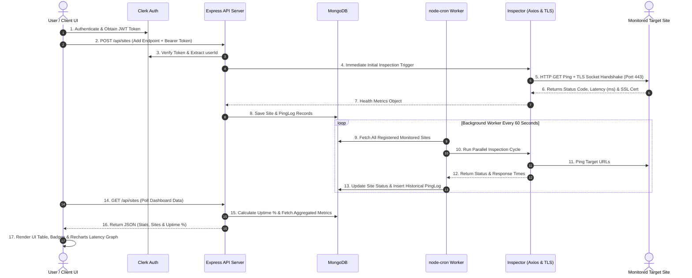

# 🛡️ Uptime Sentinel (`uptime_sentinal`)

> **Production-Ready, Real-Time Website & API Monitoring System** built with Node.js, Express, MongoDB, React, Vite, Node-Cron, Native TLS sockets, and Clerk Authentication.

---

## 📖 Overview

**Uptime Sentinel** is an enterprise-grade full-stack monitoring platform built to track website uptime, API availability, latency trends, and SSL certificate validity.

It operates on a **micro-engine background worker architecture**: while the backend serves REST endpoints to the React frontend, an asynchronous background cron worker continuously inspects registered websites every 60 seconds, logging response times, HTTP status codes, and SSL certificate validity into MongoDB.

---

## ⚙️ How Things Work (System Workflow)

The complete end-to-end operational flow of Uptime Sentinel is structured across 6 core sub-systems:



### 1. User Authentication & Multi-Tenancy Security
- **Authentication**: Powered by **Clerk** (`@clerk/clerk-react` on frontend, `@clerk/express` on backend).
- **Isolation**: When a user logs in, every API request transmits a Clerk Bearer JWT token in the `Authorization` header.
- **Middleware Security**: The `@clerk/express` `requireAuth()` middleware validates tokens on every route. Monitored endpoints are strictly tied to the user's unique `userId` (`Site.find({ userId })`), guaranteeing isolation between user accounts.

### 2. Service Registration & Input Normalization
- When adding a monitor via `POST /api/sites`:
  - **URL Sanitization**: Formats inputs automatically (e.g. converting `github.com` into `https://github.com`).
  - **Syntax Validation**: Validates the web address using Node's `URL` constructor.
  - **Anti-Duplication**: Rejects requests if a monitor with the exact same URL or Name (case-insensitive regex) already exists under that user account.
  - **Immediate First Check**: Instantly triggers an initial inspection before returning `201 Created`, ensuring newly registered sites display accurate status data immediately.

### 3. Asynchronous Health & Latency Inspection
Every site check invokes the `inspectSite()` service in `server/services/inspector.js`:
- **HTTP Latency Measurement**:
  - Sends an `axios.get(url)` with a **10-second timeout** and custom User-Agent `UptimeSentinel/1.0`.
  - Measures execution duration in milliseconds: `responseTime = Date.now() - startTime`.
  - Configured with `validateStatus: false` so 4xx/5xx status codes are handled explicitly.
- **Status Classification Logic**:
  - `UP`: HTTP Status is `200-399`, `401`, or `404` AND response latency is $\le 2000\text{ms}$.
  - `DEGRADED`: HTTP Status is operational but response latency $> 2000\text{ms}$.
  - `DOWN`: Network timeout, DNS lookup failure, connection refusal, or HTTP `5xx` error.

### 4. Native TLS Socket SSL Expiry Checker
For all `https://` URLs, the inspector connects directly to port `443` using Node.js's native `tls` module:
- Opens a TLS socket (`tls.connect(443, hostname, { servername: hostname })`).
- Extracts the peer certificate details (`cert.valid_to`).
- Computes remaining days until expiration:
$$\text{Days Remaining} = \left\lfloor \frac{\text{Expiry Date} - \text{Current Date}}{1000 \times 60 \times 60 \times 24} \right\rfloor$$
- **UI Color Warning Rules**:
  - 🟢 **Green**: $> 30\text{ days}$ remaining
  - 🟡 **Yellow**: $8 \text{ to } 30\text{ days}$ remaining (Warning)
  - 🔴 **Red**: $\le 7\text{ days}$ remaining (Critical renewal risk)

### 5. Automated 60-Second Background Cron Engine
- Managed by `server/services/cronWorker.js` using `node-cron`.
- Scheduled pattern: `* * * * *` (triggers every 60 seconds).
- Loops through all registered monitors in MongoDB, executes `inspectSite()`, updates the main `Site` document with latest latency/status/SSL data, and appends a time-stamped entry into the `PingLog` collection.

### 6. Dynamic Dashboard Visualization & Telemetry Polling
- **Auto-Refresh**: The React frontend polls `GET /api/sites` every 30 seconds to update health indicators, statistics cards, and time-ago timestamps.
- **Historic Data Graphing**: Clicking any service row requests `GET /api/sites/:id/logs` (fetching the latest 50 ping entries).
- **Status-Aware Recharts**: Plots latency (ms) over time with custom data-point dot rendering:
  - 🔵 **Blue Dots**: Operational pings
  - 🔴 **Red Dots**: Failed / DOWN pings

---

## 🛠️ How It Was Made (Tech Stack Breakdown)

### **Frontend Architecture (`/client`)**

| Library / Tool | Version | Purpose & Implementation Details |
| :--- | :--- | :--- |
| **React 18** | `^18.3.1` | Component-based UI rendered inside Vite application shell |
| **Vite** | `^8.2.1` | Next-generation fast frontend bundler & dev server |
| **@clerk/clerk-react** | `^5.61.9` | Client auth wrapper supplying `<SignedIn>`, `<SignedOut>`, and `<UserButton>` |
| **recharts** | `^3.10.1` | SVG responsive line chart rendering historical ping latency telemetry |
| **lucide-react** | `^1.30.0` | UI icon library (Activity, ShieldCheck, AlertTriangle, XCircle, Search, etc.) |
| **axios** | `^1.19.0` | Asynchronous HTTP client transmitting Clerk Bearer tokens |

### **Backend Architecture (`/server`)**

| Library / Tool | Version | Purpose & Implementation Details |
| :--- | :--- | :--- |
| **Node.js** | `v18+` | Asynchronous event-driven JavaScript runtime engine |
| **Express 5** | `^5.2.1` | Core REST API web application framework |
| **MongoDB & Mongoose** | `^9.9.1` | Document database for storing `Site` definitions & `PingLog` telemetry |
| **@clerk/express** | `^2.1.52` | Express middleware validating JWT tokens via `requireAuth()` |
| **node-cron** | `^4.6.0` | Background cron scheduler for running automatic 60s health inspections |
| **Native Node `tls`** | `Built-in` | Direct socket handshake on port 443 to inspect SSL certificate validity |
| **cors** | `^2.8.6` | Cross-Origin Resource Sharing middleware enabling React frontend access |
| **dotenv** | `^17.4.2` | Environment configuration manager for ports, MongoDB URIs, and Clerk keys |

---

## 🗄️ Database Schemas & Aggregation

### **1. Site Schema (`models/Site.js`)**
Stores configured monitors attached to individual users:
```javascript
{
  userId: { type: String, required: true, index: true },
  name: { type: String, required: true, trim: true },
  url: { type: String, required: true, trim: true },
  status: { type: String, enum: ["UP", "DOWN", "DEGRADED"], default: "UP" },
  lastChecked: { type: Date, default: Date.now },
  lastResponseTime: { type: Number, default: 0 },
  lastStatusCode: { type: Number, default: null },
  sslDaysRemaining: { type: Number, default: null },
  alertWebhookUrl: { type: String, default: "" },
  consecutiveFailures: { type: Number, default: 0 }
}
```

### **2. PingLog Schema (`models/PingLog.js`)**
Stores historical telemetry for latency graphing and exact uptime calculations:
```javascript
{
  siteId: { type: Schema.Types.ObjectId, ref: "Site", required: true },
  statusCode: { type: Number },
  responseTime: { type: Number },
  status: { type: String, enum: ["UP", "DOWN", "DEGRADED"] },
  errorMessage: { type: String, default: null }
}
```

### **3. True Uptime Percentage Formula**
In `GET /api/sites`, uptime percentage is calculated on-the-fly for each site:
$$\text{Uptime Percentage} = \left( \frac{\text{Total UP Logs}}{\text{Total Logs}} \right) \times 100$$

---

## 📁 Repository Directory Layout

```
uptime_sentinal/
├── client/                     # React Single Page Application (Frontend)
│   ├── src/
│   │   ├── App.jsx             # Dashboard UI, Auth routing, Recharts integration
│   │   ├── main.jsx            # React root & ClerkProvider initialization
│   │   └── index.css           # Global typography & style reset
│   ├── .env                    # Client environment variables
│   ├── package.json            # Client dependencies & scripts
│   └── vite.config.js          # Vite build configuration
│
├── server/                     # Express API Server & Cron Engine (Backend)
│   ├── config/
│   │   └── db.js               # MongoDB Mongoose connection setup
│   ├── models/
│   │   ├── Site.js             # Site Schema definition
│   │   └── PingLog.js          # Historical Ping Log Schema definition
│   ├── routes/
│   │   └── siteRoutes.js       # Express REST endpoints (Protected via Clerk)
│   ├── services/
│   │   ├── inspector.js        # Axios HTTP inspector & TLS SSL checker
│   │   └── cronWorker.js       # Background cron worker (60s cycle)
│   ├── .env                    # Server environment variables
│   ├── package.json            # Server dependencies & scripts
│   └── server.js               # Express application entry point
│
└── README.md                   # Complete system documentation
```

---

## 🚀 Quickstart & Installation Guide

### **Prerequisites**
- **Node.js** (v18 or higher)
- **npm** (v9 or higher)
- **MongoDB** (Local instance or MongoDB Atlas cluster connection string)
- **Clerk Account** (Free tier at [clerk.com](https://clerk.com))

---

### **Step 1: Clone Repository**
```bash
git clone https://github.com/goraiabhijit/uptime_sentinal.git
cd uptime_sentinal
```

---

### **Step 2: Backend Setup (`/server`)**

1. Enter server directory:
   ```bash
   cd server
   ```

2. Install backend dependencies:
   ```bash
   npm install
   ```

3. Configure environment variables in `server/.env`:
   ```env
   PORT=5000
   MONGO_URI=mongodb://localhost:27017/site_uptime_db
   CLERK_PUBLISHABLE_KEY=your_clerk_publishable_key
   CLERK_SECRET_KEY=your_clerk_secret_key
   ```

4. Launch backend server & background worker:
   ```bash
   # Development mode with Nodemon
   npm run dev

   # Production mode
   npm start
   ```

---

### **Step 3: Frontend Setup (`/client`)**

1. In a new terminal window, enter client directory:
   ```bash
   cd client
   ```

2. Install frontend dependencies:
   ```bash
   npm install
   ```

3. Configure environment variables in `client/.env`:
   ```env
   VITE_CLERK_PUBLISHABLE_KEY=your_clerk_publishable_key
   VITE_API_BASE_URL=http://localhost:5000/api/sites
   ```

4. Launch Vite dev server:
   ```bash
   npm run dev
   ```

5. Open your browser and navigate to `http://localhost:5173`.

---

## 🔌 API Endpoints Specification

All `/api/sites` routes require a valid Clerk JWT Bearer token passed in headers (`Authorization: Bearer <token>`).

| Method | Endpoint | Description | Request Payload / Params |
| :--- | :--- | :--- | :--- |
| `GET` | `/api/sites` | Fetch all monitors & stats for logged-in user | None |
| `POST` | `/api/sites` | Register new site & trigger instant initial ping | `{ "name": "Google", "url": "https://google.com", "alertWebhookUrl": "" }` |
| `POST` | `/api/sites/:id/ping` | Trigger instant manual ping for monitor | `:id` (MongoDB ObjectId) |
| `GET` | `/api/sites/:id/logs` | Fetch up to 50 historical ping logs for chart | `:id` (MongoDB ObjectId) |
| `PUT` | `/api/sites/:id` | Update monitor configuration (Name, URL, Webhook) | `{ "name": "Google Prod", "url": "https://google.com" }` |
| `DELETE` | `/api/sites/:id` | Delete monitor and clean up all related ping logs | `:id` (MongoDB ObjectId) |

---

## 📝 License

Distributed under the **ISC License**.

---

## 👨‍💻 Author

**Abhijit Gorai**
- GitHub: [@goraiabhijit](https://github.com/goraiabhijit)

*Created with ❤️ for service availability, real-time analytics, and web monitoring reliability.*
